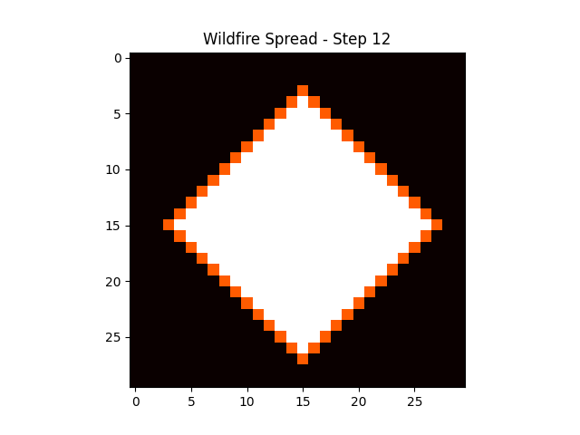

# Parallel Wildfire Spread Simulation (HPC)


This project implements a **wildfire spread simulation** using concepts from **High Performance Computing (HPC)**. The wildfire propagates across a forest grid using iterative computation and is executed using MPI.

The project also demonstrates **containerized execution using Docker** and **visualization using Python**.

---

## Simulation Visualization



---

## Technologies Used

- C
- MPI (Message Passing Interface)
- Docker
- Python
- Matplotlib

---

## Project Description

The forest is represented as a **two-dimensional grid** where each cell represents a portion of the forest.

Each grid cell can exist in one of three states:

| Symbol | Meaning |
|------|------|
| T | Tree |
| F | Fire |
| B | Burned |

### Fire Spread Rules

1. The forest grid is initialized with trees.
2. Fire starts at the **center of the grid**.
3. At every simulation step:
   - Burning trees become burned.
   - Neighboring trees catch fire if adjacent to a burning cell.
4. The simulation runs for multiple time steps.

---

## Project Structure

```
wildfire-hpc-simulation
│
├── wildfire.c          # MPI wildfire simulation
├── visualize_fire.py   # Python visualization
├── Dockerfile          # Container environment
├── simulation.png      # Visualization screenshot
└── README.md
```

---

## Running the Simulation

### Build Docker Container

```bash
docker build -t wildfire-hpc .
```

### Run Simulation

```bash
docker run wildfire-hpc
```

---

## Running the Visualization

Run the wildfire visualization using Python:

```bash
python3 visualize_fire.py
```

This will display the wildfire spread step-by-step.

---

## Example Simulation Output

Final Forest State (Step 12)

```
T T T T T T T T T T T T T T T T T T T T T T T T T T T T T T
T T T T T T T T T T T T T F F F T T T T T T T T T T T T T T
T T T T T T T T T T T T F B B B F T T T T T T T T T T T T T
T T T T T T T T T T T F B B B B B F T T T T T T T T T T T T
T T T T T T T T T T F B B B B B B B F T T T T T T T T T T T
T T T T T T T T T F B B B B B B B B B F T T T T T T T T T T
T T T T T T T T F B B B B B B B B B B B F T T T T T T T T T
T T T T T T T F B B B B B B B B B B B B B F T T T T T T T T
T T T T T T F B B B B B B B B B B B B B B B F T T T T T T T
T T T T T F B B B B B B B B B B B B B B B B B F T T T T T T
T T T T F B B B B B B B B B B B B B B B B B B B F T T T T T
T T T F B B B B B B B B B B B B B B B B B B B B B F T T T T
T T F B B B B B B B B B B B B B B B B B B B B B B B F T T T
T F B B B B B B B B B B B B B B B B B B B B B B B B B F T T
F B B B B B B B B B B B B B B B B B B B B B B B B B B B F T
T F B B B B B B B B B B B B B B B B B B B B B B B B B F T T
T T F B B B B B B B B B B B B B B B B B B B B B B B F T T T
T T T F B B B B B B B B B B B B B B B B B B B B B F T T T T
T T T T F B B B B B B B B B B B B B B B B B B B F T T T T T
T T T T T F B B B B B B B B B B B B B B B B B F T T T T T T
T T T T T T F B B B B B B B B B B B B B B B F T T T T T T T
T T T T T T T F B B B B B B B B B B B B B F T T T T T T T T
T T T T T T T T F B B B B B B B B B B B F T T T T T T T T T
T T T T T T T T T F B B B B B B B B B F T T T T T T T T T T
T T T T T T T T T T F B B B B B B B F T T T T T T T T T T T
T T T T T T T T T T T F B B B B B F T T T T T T T T T T T T
T T T T T T T T T T T T F B B B F T T T T T T T T T T T T T
T T T T T T T T T T T T T F B F T T T T T T T T T T T T T T
T T T T T T T T T T T T T T F T T T T T T T T T T T T T T T
T T T T T T T T T T T T T T T T T T T T T T T T T T T T T T
```

Legend:

```
T → Tree
F → Fire
B → Burned
```

---

## HPC Concepts Demonstrated

- Grid-based computational modeling
- Iterative wildfire propagation
- Parallel runtime using MPI
- Containerized execution using Docker
- Scientific visualization of simulation results

---

## Author

**Naved Ahmed Shaik**  
B.Tech Computer Science & Engineering  
SR University
